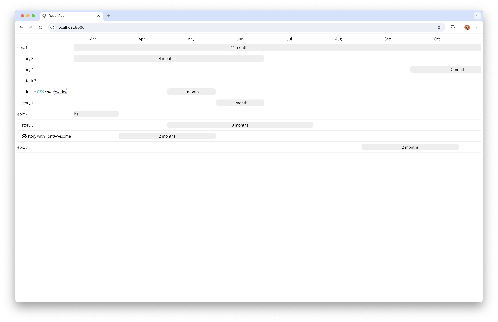

# Gantt chart



This is a hand-made implementation of a relatively simple Gantt chart. This new implementation uses CSS3 Grids instead of D3 or Canvas.

See more details on [my blog](https://shybovycha.github.io/2024/06/27/gantt-chart-part4.html).

## Building

```bash
$ yarn install
$ yarn build
```

You can run the demo with

```bash
$ yarn run
```

Then open `localhost:8000` file in your browser.

## Demo

You can see the example (`public/index.html`) live, on [my blog](https://shybovycha.github.io/2024/06/27/gantt-chart-part4.html).
